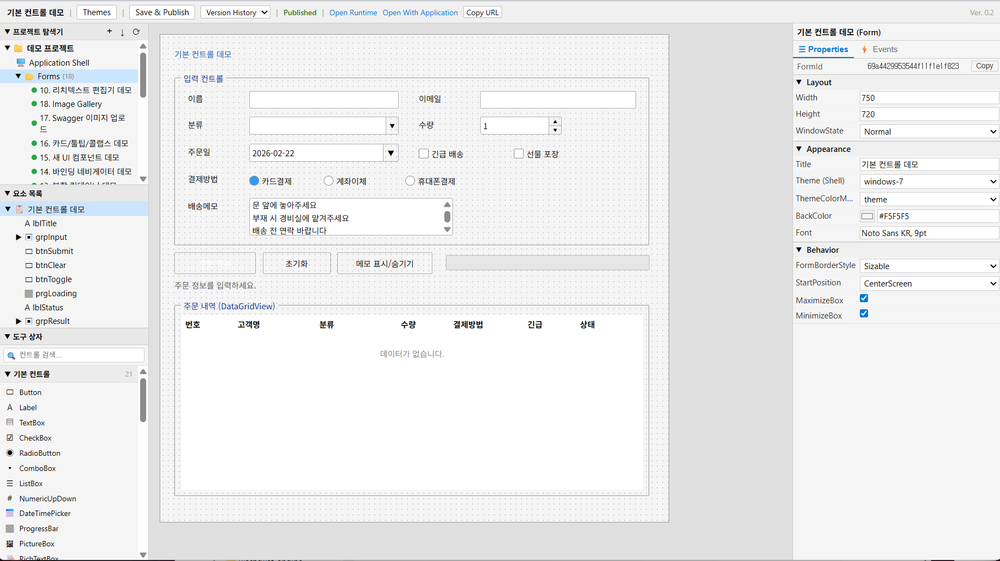

# WebForm

웹 브라우저에서 Microsoft Visual Studio의 WinForm 디자이너 경험을 재현하는 **Server-Driven UI(SDUI)** 기반 로우코드 폼 빌더입니다.



## 주요 기능

- **비주얼 폼 디자이너** — 드래그 앤 드롭으로 Button, TextBox, ComboBox, DataGridView 등 42종의 컨트롤을 배치하고 속성을 편집
- **이벤트 핸들러** — Monaco Editor에서 JavaScript 이벤트 코드를 작성하면 서버의 isolated-vm 샌드박스에서 안전하게 실행
- **데이터소스 & 데이터 바인딩** — MySQL, PostgreSQL, MSSQL, MongoDB, REST API, Static 등 다양한 데이터소스를 연결하고, Designer에서 미리보기·테스트 쿼리 실행, 이벤트 핸들러에서 구조화 쿼리 또는 raw SQL로 데이터 조회
- **SwaggerConnector** — OpenAPI/Swagger YAML을 임포트하여 이벤트 핸들러에서 REST API를 직접 호출. multipart 업로드 지원
- **Google OAuth2 인증** — Application Shell 레벨에서 Google 계정 기반 사용자 인증 및 도메인 화이트리스트 적용
- **실시간 미리보기** — WebSocket을 통해 디자이너 변경사항이 런타임에 즉시 반영
- **프로젝트 관리** — 솔루션/프로젝트 단위로 여러 폼을 구조화하여 관리
- **MCP 서버** — Model Context Protocol을 통해 Claude 등 AI 어시스턴트가 47개 도구로 폼 설계/개발/배포를 자동화. 원격 접속 지원

## 아키텍처

```
┌──────────────┐     ┌──────────────┐     ┌──────────────┐
│   Designer   │     │   Runtime    │     │  MCP Server  │
│  (React)     │     │  (React)     │     │  (stdio/HTTP)│
│  :3000       │     │  :3001       │     │  :4100       │
└──────┬───────┘     └──────┬───────┘     └──────┬───────┘
       │  /api proxy        │  /api proxy        │
       └────────┬───────────┴────────────────────┘
                ▼
        ┌───────────────┐
        │    Server     │
        │  (Express)    │
        │  :4000        │
        ├───────────────┤
        │  EventEngine  │──▶ isolated-vm 샌드박스
        │  WebSocket    │──▶ 실시간 동기화
        └───────┬───────┘
                │
        ┌───────┴───────┐
        │               │
   ┌────▼────┐    ┌─────▼────┐
   │ MongoDB │    │  Redis   │
   └─────────┘    └──────────┘
```

Designer에서 만든 폼 정의(JSON)를 서버에 저장하고, Runtime이 이를 로드하여 React 컴포넌트로 렌더링합니다. 사용자 이벤트는 서버의 샌드박스에서 실행되어 UI 패치로 반환됩니다.

## 사전 요구사항

| 항목 | 버전 | 비고 |
|------|------|------|
| **Node.js** | 18 이상 | |
| **pnpm** | 9.x | `npm install -g pnpm@9` |
| **Docker** | — | Redis 컨테이너 실행용 |
| **MongoDB** | 7.x 이상 | 로컬 또는 Atlas 등 원격 인스턴스 |

## 설치 및 실행

### 빠른 시작

```bash
git clone <repository-url>
cd webform
./run.sh
```

`run.sh`가 다음을 자동으로 수행합니다:
1. pnpm 설치 확인
2. 의존성 설치 (`pnpm install`)
3. Redis Docker 컨테이너 시작
4. 서버 `.env` 파일 생성 (JWT_SECRET, ENCRYPTION_KEY 랜덤 생성)
5. 모든 서비스 시작 (Designer :3000, Runtime :3001, Server :4000)

### 초기 데이터 설정

서버가 실행된 상태에서 **별도 터미널**에서 다음 스크립트를 실행합니다.

```bash
# 프리셋 테마 시딩 (24개 테마 → MongoDB)
./generate-themes.sh

# 데모 프로젝트 + 샘플 데이터 생성 (선택)
./generate-sample.sh
```

| 스크립트 | 용도 | 사전 조건 |
|----------|------|-----------|
| `generate-themes.sh` | 24개 프리셋 테마를 API로 MongoDB에 시딩 | 서버 실행 중, `.env`에 JWT_SECRET |
| `generate-sample.sh` | 데모 프로젝트 + 샘플 폼 + MongoDB 주문 데이터 생성 | 서버 실행 중, Docker(MongoDB 컨테이너), `.env`에 JWT_SECRET |

> **참고**: `generate-themes.sh`는 upsert 방식이므로 반복 실행해도 안전합니다. 최초 실행 시 `24 upserted`, 재실행 시 `24 unchanged`가 출력됩니다.

### 수동 설치

```bash
# 1. 의존성 설치
pnpm install

# 2. Redis 실행
docker run -d --name webform-redis -p 6379:6379 redis:7-alpine

# 3. 서버 환경 변수 설정
cp packages/server/.env.example packages/server/.env
# .env 파일에서 JWT_SECRET(32자 이상)과 ENCRYPTION_KEY(64자 hex)를 변경

# 4. 실행
pnpm dev

# 5. 별도 터미널에서 초기 데이터 설정
./generate-themes.sh       # 프리셋 테마 시딩
./generate-sample.sh       # 데모 데이터 (선택)
```

### 개별 서비스 실행

```bash
pnpm dev:server      # Server   — http://localhost:4000
pnpm dev:designer    # Designer — http://localhost:3000
pnpm dev:runtime     # Runtime  — http://localhost:3001
```

### Docker로 실행

외부 레지스트리 없이 로컬에서 Docker 이미지를 빌드하고 전체 시스템을 실행합니다.

**사전 요구사항**: Docker, Docker Compose

```bash
# 이미지 빌드 + 실행
./build.sh up

# 이미지 빌드만
./build.sh

# 종료
./build.sh down

# 재시작 (rebuild + up)
./build.sh restart

# 로그 확인
./build.sh logs
```

최초 `./build.sh up` 실행 시 `.env.docker` 파일이 자동 생성되며, JWT_SECRET, ENCRYPTION_KEY, MCP_API_KEYS가 랜덤으로 설정됩니다.

**서비스 접속 정보** (로컬 개발과 동일한 포트):

| 서비스 | URL | 비고 |
|--------|-----|------|
| Designer | `http://localhost:3000` | nginx 컨테이너 |
| Runtime | `http://localhost:3001` | Express 컨테이너 |
| API | `http://localhost:4000/api` | Express 컨테이너 |
| Swagger | `http://localhost:4000/api-docs` | |
| Health | `http://localhost:4000/health` | |
| MCP | `http://localhost:4100/mcp` | MCP 원격 서버 컨테이너 |

**Docker 구성**:

```
┌─────────────────────────────────────────────┐
│  designer (nginx :80 → host :3000)          │
│  └── Designer SPA + API/WS 프록시 → webform │
├─────────────────────────────────────────────┤
│  webform (Express :4000 → host :3001,:4000) │
│  ├── /api/*   → API 라우트                  │
│  ├── /auth/*  → 인증 라우트                 │
│  ├── /ws/*    → WebSocket                   │
│  └── /*       → Runtime SPA                 │
├─────────────────────────────────────────────┤
│  mcp (Node :4100 → host :4100)              │
│  └── /mcp     → MCP Streamable HTTP         │
├──────────────┬──────────────────────────────┤
│  MongoDB :27017 (내부)  │  Redis :6379 (내부) │
└──────────────┴──────────────────────────────┘
```

**초기 데이터 설정**: Docker 실행 후 로컬 개발과 동일하게 테마 시딩 및 샘플 데이터를 생성할 수 있습니다.

```bash
./generate-themes.sh       # 프리셋 테마 시딩
./generate-sample.sh       # 데모 데이터 (선택)
```

### 테스트

```bash
pnpm test            # 전체 테스트
pnpm test:watch      # Watch 모드
```

## 환경 변수

서버 환경 변수는 `packages/server/.env`에서 설정합니다.

| 변수 | 기본값 | 설명 |
|------|--------|------|
| `PORT` | `4000` | 서버 포트 |
| `MONGODB_URI` | `mongodb://localhost:27017/webform` | MongoDB 연결 URI |
| `REDIS_URL` | `redis://localhost:6379` | Redis 연결 URL |
| `JWT_SECRET` | — | JWT 서명 키 (32자 이상, 필수) |
| `ENCRYPTION_KEY` | — | AES-256 암호화 키 (64자 hex, 필수) |
| `CORS_ORIGINS` | `http://localhost:3000,http://localhost:3001` | 허용 CORS 출처 |
| `SANDBOX_TIMEOUT_MS` | `5000` | 이벤트 핸들러 실행 타임아웃 |
| `SANDBOX_MEMORY_LIMIT_MB` | `128` | 샌드박스 메모리 제한 |
| `GOOGLE_CLIENT_SECRET` | — | Google OAuth2 Client Secret (Shell 인증 사용 시) |
| `RUNTIME_BASE_URL` | `http://localhost:3001` | Runtime URL (OAuth 콜백 리다이렉트) |

## 데이터소스

WebForm은 다양한 데이터베이스와 외부 데이터소스를 연결하여 폼에서 데이터를 조회·표시할 수 있습니다.

### 지원 데이터소스

| 타입 | Dialect | 설명 |
|------|---------|------|
| **Database** | MySQL | mysql2 드라이버, utf8mb4 |
| | PostgreSQL | pg 드라이버 |
| | MSSQL | mssql 드라이버, OFFSET...FETCH 문법 |
| | MongoDB | mongodb 드라이버, 풀링 |
| **REST API** | — | HTTP 호출, Bearer/Basic/API Key 인증 |
| **Static** | — | 메모리 내 정적 JSON 데이터 |

### Designer 데이터소스 패널

Designer 좌측 패널에서 데이터소스를 관리합니다:

- **추가/편집/삭제** — 연결 정보 설정 (호스트, 포트, 인증 등)
- **연결 테스트** — 편집 다이얼로그 내에서 바로 테스트 가능
- **ID 복사** — 편집 다이얼로그에서 데이터소스 ID를 클립보드로 복사 (이벤트 핸들러에서 사용)
- **미리보기** — 테이블/컬렉션 목록을 드롭다운으로 조회하고, 테스트 쿼리(SQL 또는 MongoDB JSON)를 직접 실행

### 쿼리 API

`POST /api/datasources/:id/query`

#### 구조화 쿼리 (SQL DB)

```javascript
ctx.http.post(BASE + DS_URL + '/query', {
  table: 'employees',
  filter: { department: 'Engineering' },
  columns: ['id', 'name', 'email'],
  limit: 100,
  offset: 0
});
```

#### Raw SQL 쿼리

`sql` 필드를 사용하면 SELECT 쿼리를 직접 실행할 수 있습니다 (SELECT만 허용, 멀티 스테이트먼트 차단).

```javascript
ctx.http.post(BASE + DS_URL + '/query', {
  sql: "SELECT e.name, d.dept_name FROM employees e JOIN departments d ON e.dept_id = d.id WHERE d.dept_name = 'Sales' ORDER BY e.name LIMIT 50"
});
```

#### MongoDB 구조화 쿼리

```javascript
ctx.http.post(BASE + DS_URL + '/query', {
  collection: 'employees',
  filter: { age: { $gt: 30 } },
  projection: { name: 1, email: 1 },
  limit: 100,
  skip: 0
});
```

### 이벤트 핸들러 예제

```javascript
const BASE = 'http://localhost:4000';
const DS = '/api/datasources/<datasource-id>';

// 부서 필터 + 이름 검색
const dept = ctx.controls.cmbDepartment.selectedValue;
const name = ctx.controls.txtSearchName.text || '';

// 방법 1: Raw SQL (JOIN, LIKE 등 자유롭게 사용)
const res = ctx.http.post(BASE + DS + '/query', {
  sql: `SELECT * FROM employees WHERE department = '${dept}' AND name LIKE '%${name}%' ORDER BY id LIMIT 100`
});

// 방법 2: 구조화 쿼리 (간단한 조건)
const res2 = ctx.http.post(BASE + DS + '/query', {
  table: 'employees',
  filter: { department: dept },
  limit: 100
});

if (res.ok) {
  ctx.controls.gridEmployees.dataSource = res.data.data;
}
```

### REST API 엔드포인트

| 메서드 | 경로 | 설명 | 인증 |
|--------|------|------|------|
| `GET` | `/api/datasources/dialects` | 지원 dialect 목록 (mysql, postgresql, mssql, mongodb) | 불필요 |
| `GET` | `/api/datasources` | 데이터소스 목록 조회 (page, limit, search, type, projectId) | 필요 |
| `POST` | `/api/datasources` | 데이터소스 생성 | 필요 |
| `GET` | `/api/datasources/:id` | 단일 데이터소스 조회 (config 복호화 포함) | 필요 |
| `PUT` | `/api/datasources/:id` | 데이터소스 수정 | 필요 |
| `DELETE` | `/api/datasources/:id` | 데이터소스 삭제 (soft delete) | 필요 |
| `GET` | `/api/datasources/:id/tables` | 테이블/컬렉션 목록 조회 | 필요 |
| `POST` | `/api/datasources/:id/test` | 연결 테스트 | 필요 |
| `POST` | `/api/datasources/:id/query` | 구조화 쿼리 실행 (table/filter 또는 sql 필드) | 필요 |
| `POST` | `/api/datasources/:id/raw-query` | Raw 쿼리 실행 (SQL SELECT 또는 MongoDB JSON) | 필요 |

### 샌드박스 보안

이벤트 핸들러에서 `ctx.http`로 데이터소스 API를 호출할 때, 서버는 다음 보안 메커니즘을 적용합니다:

- **SSRF 방어** — 샌드박스 내부 HTTP 요청은 `validateSandboxUrl()`을 통해 내부 IP(127.x, 10.x, 172.16-31.x, 192.168.x), 클라우드 메타데이터 서비스(169.254.169.254) 접근을 차단. localhost:4000(서버 자체)만 허용
- **샌드박스 내부 인증** — 샌드박스에서 서버 API 호출 시 `X-Sandbox-Internal` 헤더가 자동 추가되어, 별도 JWT 없이 인증을 우회

## SwaggerConnector

**SwaggerConnector**는 OpenAPI/Swagger 스펙을 기반으로 이벤트 핸들러에서 외부 REST API를 직접 호출할 수 있는 비시각적 커넥터 컨트롤입니다.

### 주요 기능

- OpenAPI 3.x / Swagger 2.x YAML 임포트
- 자동 operationId 추출 및 생성
- Path/Query 파라미터, Request Body, Custom Headers 지원
- `multipart/form-data` 파일 업로드 (Base64 dataUrl → 파일 변환)
- Designer에서 API 목록 미리보기 및 테스트 실행

### 디자이너 설정

1. 폼에 **SwaggerConnector** 컨트롤을 추가
2. 속성 패널에서 `specYaml`에 OpenAPI YAML을 붙여넣거나 파일 Import
3. `baseUrl`로 서버 주소 오버라이드 (선택)
4. `defaultHeaders`에 인증 헤더 설정 (예: `{"Authorization": "Bearer xxx"}`)

### 이벤트 핸들러에서 사용

```javascript
// operationId 기반 API 호출
const result = await ctx.controls.petApi.listPets({
  query: { limit: 10 }
});

// Path 파라미터 + Request Body
const updated = await ctx.controls.petApi.updatePet({
  path: { petId: 123 },
  body: { name: 'Buddy Jr' }
});

// multipart 파일 업로드
const upload = await ctx.controls.fileApi.uploadFile({
  body: {
    file: { dataUrl: 'data:image/png;base64,...', filename: 'photo.png' },
    description: 'My photo'
  }
});

// 응답: { status: number, ok: boolean, data: unknown }
if (result.ok) {
  ctx.controls.grid.dataSource = result.data;
}
```

## Google OAuth2 인증

Application Shell 레벨에서 Google OAuth2 기반 사용자 인증을 적용하여 Runtime 접근을 제어합니다.

### 인증 흐름

```
사용자가 Runtime 접속
  → Shell의 auth 설정 확인
  → 인증 필요 시 LoginRequiredPage 표시
  → "Google로 로그인" 클릭
  → Google OAuth2 인증
  → 서버에서 ID Token 검증 + 도메인 화이트리스트 확인
  → Runtime JWT 발급 (24시간)
  → URL fragment로 토큰 전달 → localStorage 저장
```

### 설정 방법

1. **Google Cloud Console**에서 OAuth2 클라이언트 생성
   - Redirect URI: `{RUNTIME_BASE_URL}/auth/google/callback`

2. **서버 환경 변수** (`packages/server/.env`):
   ```
   GOOGLE_CLIENT_SECRET=<Google OAuth Client Secret>
   RUNTIME_BASE_URL=http://localhost:3001
   ```

3. **Shell 인증 설정** (디자이너 또는 API):
   ```json
   {
     "auth": {
       "enabled": true,
       "provider": "google",
       "googleClientId": "xxx.apps.googleusercontent.com",
       "allowedDomains": ["example.com"]
     }
   }
   ```
   `allowedDomains`를 빈 배열로 설정하면 모든 Google 계정을 허용합니다.

## MCP 서버 (AI 통합)

**Model Context Protocol(MCP)** 서버를 통해 Claude 등 AI 어시스턴트가 WebForm 플랫폼의 전체 기능을 자동으로 제어할 수 있습니다.

### 47개 MCP 도구

| 카테고리 | 도구 수 | 주요 도구 |
|---------|--------|----------|
| 프로젝트 관리 | 8 | `create_project`, `export_project`, `import_project`, `publish_all` |
| 폼 관리 | 8 | `create_form`, `update_form`, `publish_form`, `get_form_versions` |
| 컨트롤 조작 | 8 | `add_control`, `batch_add_controls`, `list_control_types`, `get_control_schema` |
| 이벤트 핸들러 | 6 | `add_event_handler`, `test_event_handler`, `list_available_events` |
| 데이터소스 | 7 | `create_datasource`, `test_datasource_connection`, `query_datasource` |
| 데이터 바인딩 | 3 | `add_data_binding`, `remove_data_binding`, `list_data_bindings` |
| 테마 | 6 | `create_theme`, `apply_theme_to_form` |
| Shell | 5 | `create_shell`, `update_shell`, `publish_shell` |
| 런타임/디버그 | 4 | `execute_event`, `debug_execute`, `get_runtime_app` |
| 유틸리티 | 3 | `validate_form`, `get_server_health`, `search_controls` |

### 로컬 실행 (stdio)

Claude Desktop 또는 Claude Code에서 stdio 방식으로 연결:

```bash
# 개발 모드
pnpm --filter @webform/mcp dev

# MCP Inspector로 디버깅
npx @modelcontextprotocol/inspector npx tsx packages/mcp/src/index.ts
```

**Claude Desktop 설정** (`claude_desktop_config.json`):
```json
{
  "mcpServers": {
    "webform": {
      "command": "npx",
      "args": ["tsx", "packages/mcp/src/index.ts"],
      "cwd": "/path/to/webform",
      "env": { "WEBFORM_API_URL": "http://localhost:4000" }
    }
  }
}
```

### 원격 실행 (Streamable HTTP)

API 키 인증을 통해 원격 호스트에서 MCP 서버에 접속할 수 있습니다.

**`.env` 파일 설정** (`packages/mcp/.env`):

> `./run.sh`를 실행하면 이 파일이 자동 생성됩니다. 수동 설정이 필요한 경우 아래를 참고하세요.

```bash
# packages/mcp/.env
MCP_API_KEYS=your-secret-key-1,your-secret-key-2   # 허용 API 키 (콤마 구분, 필수)
MCP_PORT=4100                                       # HTTP 리슨 포트 (기본값: 4100)
MCP_HOST=0.0.0.0                                    # 바인드 주소 (기본값: 0.0.0.0)
WEBFORM_API_URL=http://localhost:4000               # 백엔드 API URL (기본값: http://localhost:4000)
```

API 키를 직접 생성하려면:

```bash
# 랜덤 API 키 생성
openssl rand -hex 32
```

생성된 키를 `MCP_API_KEYS`에 설정합니다. 여러 키는 콤마로 구분합니다.

**원격 MCP 서버 시작**:

```bash
pnpm --filter @webform/mcp start:remote
```

**연결 정보**:
- 엔드포인트: `http://<host>:4100/mcp`
- 인증: `Authorization: Bearer <API_KEY>` 헤더
- 헬스체크: `GET http://<host>:4100/health` (인증 불필요)

**Claude Desktop 원격 설정** (`claude_desktop_config.json`):
```json
{
  "mcpServers": {
    "webform": {
      "type": "streamable-http",
      "url": "http://your-server:4100/mcp",
      "headers": {
        "Authorization": "Bearer your-secret-key-1"
      }
    }
  }
}
```

| 환경 변수 | 기본값 | 설명 |
|-----------|--------|------|
| `MCP_API_KEYS` | — | 허용 API 키 목록 (콤마 구분, 필수) |
| `MCP_PORT` | `4100` | HTTP 리슨 포트 |
| `MCP_HOST` | `0.0.0.0` | 바인드 주소 |
| `WEBFORM_API_URL` | `http://localhost:4000` | 백엔드 API URL |

### Claude Code 계정 레벨 MCP 설정

Claude Code에서 계정(user) 레벨로 MCP 서버를 등록하면 모든 프로젝트에서 WebForm MCP 도구를 사용할 수 있습니다.

**1. MCP 원격 서버 시작** (`./run.sh` 실행 시 자동 시작, 또는 수동):

```bash
pnpm --filter @webform/mcp start:remote
```

**2. API 키 확인** (`packages/mcp/.env`에서 확인, `./run.sh` 최초 실행 시 자동 생성):

```bash
cat packages/mcp/.env | grep MCP_API_KEYS
```

**3. Claude Code에 계정 레벨로 등록**:

```bash
claude mcp add --transport http -s user webform \
  "http://localhost:4100/mcp" \
  --header "Authorization: Bearer <YOUR_API_KEY>"
```

> `-s user` 옵션이 계정(글로벌) 레벨 등록입니다. 프로젝트 레벨은 `-s project`를 사용합니다.

**4. 등록 확인**:

```bash
claude mcp list
```

**5. 삭제** (필요 시):

```bash
claude mcp remove -s user webform
```

등록 후 새 Claude Code 세션을 시작하면 47개 WebForm MCP 도구(`list_projects`, `create_form`, `add_control` 등)를 사용할 수 있습니다.

## 기술 스택

| 영역 | 기술 |
|------|------|
| 언어 | TypeScript |
| 프론트엔드 | React, Vite, Zustand, react-dnd, Monaco Editor |
| 백엔드 | Node.js, Express, WebSocket(ws) |
| 데이터베이스 | MongoDB(Mongoose), MySQL(mysql2), PostgreSQL(pg), MSSQL(mssql), Redis(ioredis) |
| 샌드박스 | isolated-vm |
| AI 통합 | MCP SDK (Streamable HTTP, stdio) |
| 인증 | JWT, Google OAuth2 |
| 테스트 | Vitest |
| 패키지 관리 | pnpm workspace |
